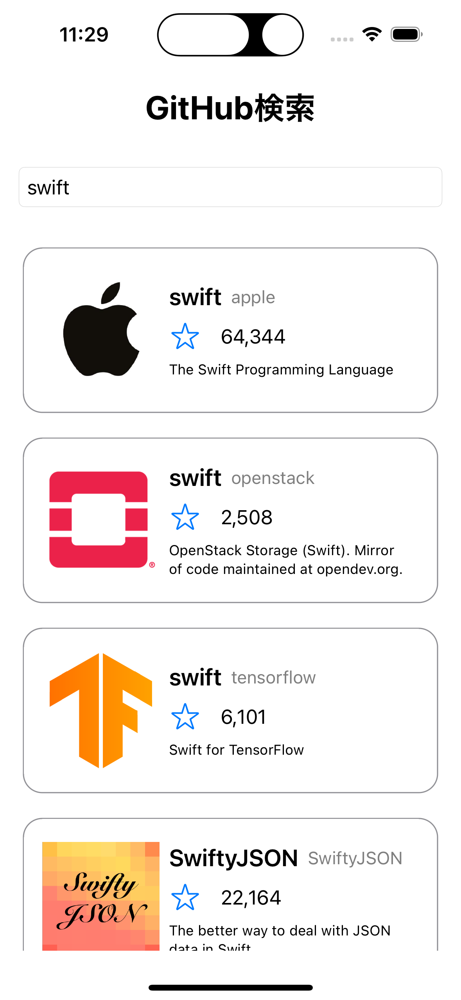
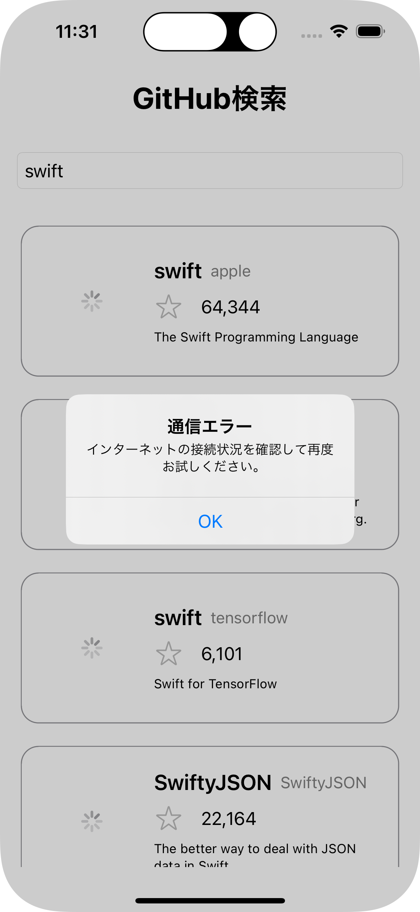
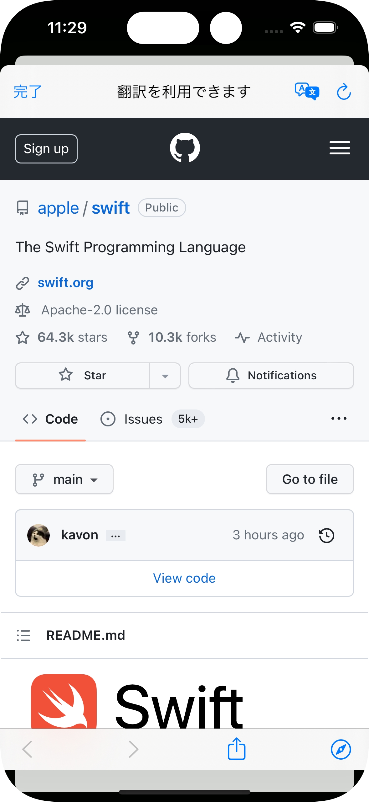

# GitHub検索クライアントアプリ
テキストフィールドに入力したリポジトリを検索します。

## 目次

- [スクリーンショット](#スクリーンショット)
- [開発](#開発)

## スクリーンショット

|検索前|検索結果（成功）|検索結果（エラー）|詳細シート（SafariView）|
|:--:|:--:|:--:|:--:|
|||||

## 開発

### 環境

- macOS Ventura 13.6 
- Xcode 14.3 (Swift 5.8)

### 構成

- UIの実装: SwiftUI
- アーキテクチャ: SV(Store View)
- ブランチモデル: GitHub flow

### こだわった点
- SV（Store View）アーキテクチャで開発を行いました。
- DIにより、「検索成功（結果あり）」、「検索成功（結果なし）」、「検索エラー」の3パターンをプレビューで確認できるようにしました。
- WebServiceのUIテストを行いました。

